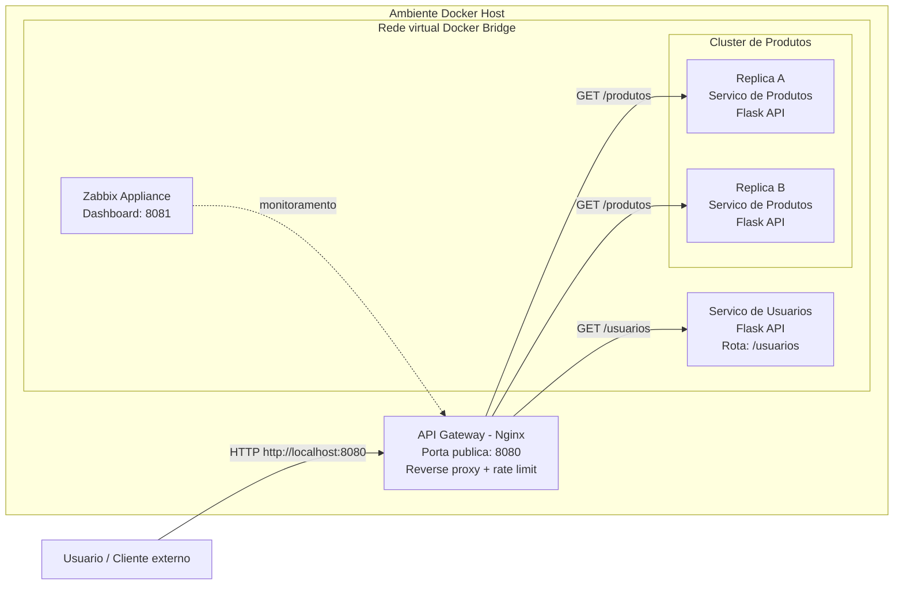

# Arquitetura de Microsservicos com API Gateway

Este projeto demonstra, na pratica, uma arquitetura baseada em microsservicos usando Docker, Flask, Nginx e Zabbix. A ideia principal e simular um ambiente onde o usuario acessa apenas um ponto de entrada, o API Gateway, enquanto os servicos internos ficam isolados dentro da rede Docker.

O projeto foi preparado para ser clonado ou duplicado no GitHub e executado diretamente com Docker Compose.

## Objetivo

O objetivo e demonstrar os seguintes conceitos:

- API Gateway como ponto unico de entrada.
- Roteamento de requisicoes para microsservicos internos.
- Isolamento dos servicos em containers.
- Comunicacao entre containers pela rede virtual do Docker.
- Balanceamento de carga no servico de produtos.
- Healthcheck para acompanhar a saude das APIs.
- Rate limiting no Nginx para protecao contra excesso de requisicoes.
- Monitoramento com Zabbix Appliance.

## Arquitetura Geral



## Como a Arquitetura Funciona

O usuario nao acessa diretamente os containers Python. Ele acessa apenas o Nginx pela porta `8080`. O Nginx atua como API Gateway, recebendo as requisicoes HTTP e decidindo para qual servico interno cada rota deve ser enviada.

Quando a rota acessada e `/usuarios`, o Gateway encaminha a requisicao para o container `servico-usuarios`, que executa uma API Flask na porta interna `5000`.

Quando a rota acessada e `/produtos`, o Gateway encaminha a requisicao para o servico `servico-produtos`. Esse servico pode subir com duas replicas, demonstrando um cluster simples de produtos. Como as replicas pertencem ao mesmo servico Docker, o acesso pelo nome `servico-produtos` permite distribuir chamadas entre os containers disponiveis.

O frontend tambem e servido pelo proprio Nginx. Ao acessar `http://localhost:8080`, o navegador carrega a pagina HTML localizada na pasta `Frontend`. Essa pagina possui botoes que fazem chamadas para `/usuarios` e `/produtos`, permitindo visualizar qual container respondeu.

## Estrutura do Projeto

```text
.
|-- docker-compose.yml
|-- README.md
|-- .gitignore
|-- Frontend/
|   `-- index.html
|-- nginx/
|   `-- nginx.conf
|-- servico-usuarios/
|   |-- app.py
|   |-- Dockerfile
|   `-- requirements.txt
`-- servico-produtos/
    |-- app.py
    |-- Dockerfile
    `-- requirements.txt
```

## Explicacao dos Componentes

### 1. API Gateway - Nginx

Arquivo principal: `nginx/nginx.conf`

Responsabilidades:

- Servir o frontend na rota `/`.
- Encaminhar `/usuarios` para o servico de usuarios.
- Encaminhar `/produtos` para o servico de produtos.
- Aplicar rate limit de `2` requisicoes por segundo por cliente.
- Retornar erro `503` personalizado quando o limite de requisicoes for ultrapassado.

Rotas configuradas no Nginx:

```text
/          -> Frontend estatico
/usuarios  -> servico-usuarios:5000
/produtos  -> servico-produtos:5000
```

### 2. Servico de Usuarios

Pasta: `servico-usuarios`

Tecnologia: Python + Flask

Rotas:

```text
GET /usuarios
GET /health
```

A rota `/usuarios` retorna uma lista simulada de usuarios e tambem informa o ID do container que respondeu. Isso ajuda a visualizar que a API esta rodando dentro de um container Docker.

Exemplo de resposta:

```json
{
  "status": "Sucesso",
  "servico": "API de Usuarios",
  "maquina_que_respondeu": "id-do-container",
  "dados": ["Alice", "Bob", "Carlos", "Diana"]
}
```

### 3. Servico de Produtos

Pasta: `servico-produtos`

Tecnologia: Python + Flask

Rotas:

```text
GET /produtos
GET /health
```

A rota `/produtos` retorna uma lista simulada de produtos e informa qual container respondeu. Como esse servico pode ser executado com duas replicas, chamadas repetidas podem mostrar IDs de containers diferentes.

Exemplo de resposta:

```json
{
  "status": "Sucesso",
  "servico": "API de Produtos",
  "maquina_que_respondeu": "id-do-container",
  "dados": ["Notebook", "Mouse sem fio", "Teclado Mecanico", "Monitor"]
}
```

### 4. Frontend

Pasta: `Frontend`

Arquivo principal: `Frontend/index.html`

O frontend e uma pagina HTML simples servida pelo Nginx. Ela possui botoes para chamar as rotas do Gateway:

- Botao de usuarios: chama `/usuarios`.
- Botao de produtos: chama `/produtos`.

O retorno da API e exibido na tela, incluindo o ID do container que respondeu.

### 5. Monitoramento com Zabbix

O `docker-compose.yml` tambem sobe um container com o Zabbix Appliance.

Portas expostas:

```text
8081  -> Dashboard web do Zabbix
10051 -> Porta do servidor Zabbix
```

Depois que os containers estiverem em execucao, o dashboard pode ser acessado em:

```text
http://localhost:8081
```

## Pre-requisitos

Para executar o projeto, e necessario ter instalado:

- Docker Desktop ou Docker Engine.
- Docker Compose.
- Portas `8080`, `8081` e `10051` livres na maquina.

## Como Executar

Clone o repositorio:

```bash
git clone https://github.com/23Almeida/arquitetura-microsservicos-api-gateway.git
cd arquitetura-microsservicos-api-gateway
```

Suba a infraestrutura:

```bash
docker compose up --build --scale servico-produtos=2
```

Se estiver usando a versao antiga do Compose, use:

```bash
docker-compose up --build --scale servico-produtos=2
```

O parametro `--scale servico-produtos=2` garante que o servico de produtos seja executado com duas replicas para demonstrar o balanceamento de carga.

## Como Acessar

Frontend principal:

```text
http://localhost:8080
```

API de usuarios:

```text
http://localhost:8080/usuarios
```

API de produtos:

```text
http://localhost:8080/produtos
```

Dashboard Zabbix:

```text
http://localhost:8081
```

## Como Testar pelo Terminal

Teste a rota de usuarios:

```bash
curl http://localhost:8080/usuarios
```

Teste a rota de produtos:

```bash
curl http://localhost:8080/produtos
```

No PowerShell:

```powershell
Invoke-RestMethod http://localhost:8080/usuarios
Invoke-RestMethod http://localhost:8080/produtos
```

## Como Verificar o Balanceamento de Carga

Execute varias chamadas para `/produtos` e observe o campo `maquina_que_respondeu`.

No Bash:

```bash
for i in {1..10}; do curl -s http://localhost:8080/produtos; echo; done
```

No PowerShell:

```powershell
1..10 | ForEach-Object {
    Invoke-RestMethod http://localhost:8080/produtos | Select-Object servico, maquina_que_respondeu
}
```

Se as duas replicas estiverem ativas, o campo `maquina_que_respondeu` pode alternar entre containers diferentes.

## Como Verificar o Rate Limit

O Nginx esta configurado para limitar o volume de requisicoes por cliente:

```nginx
limit_req_zone $binary_remote_addr zone=limite_basico:10m rate=2r/s;
limit_req zone=limite_basico burst=5 nodelay;
```

Isso significa que chamadas muito rapidas podem ser bloqueadas pelo Gateway. Quando isso acontece, o Nginx retorna status `503` com a mensagem:

```json
{
  "erro": "Protecao ativada! Muitas requisicoes por segundo."
}
```

## Healthchecks

Os servicos Flask possuem a rota `/health`, usada pelo Docker para verificar se o container esta respondendo corretamente.

```text
GET /health -> {"status": "ok"}
```

No `docker-compose.yml`, cada API possui um `healthcheck` que acessa essa rota internamente.

## Comandos Uteis

Ver containers em execucao:

```bash
docker compose ps
```

Ver logs:

```bash
docker compose logs -f
```

Parar os containers:

```bash
docker compose down
```

Recriar tudo do zero:

```bash
docker compose down --remove-orphans
docker compose up --build --scale servico-produtos=2
```

## Fluxo Resumido de uma Requisicao

1. O usuario acessa `http://localhost:8080`.
2. O Nginx entrega o frontend localizado em `Frontend/index.html`.
3. O usuario clica em um botao no frontend.
4. O navegador faz uma requisicao para `/usuarios` ou `/produtos`.
5. O Nginx recebe a requisicao e aplica o rate limit.
6. O Nginx encaminha a requisicao para o microsservico correto.
7. O Flask processa a chamada e devolve JSON.
8. O frontend exibe o resultado e o ID do container que respondeu.

## Observacoes Importantes

- Os servicos Python nao precisam ser instalados manualmente na maquina, pois cada API possui seu proprio Dockerfile.
- O usuario externo acessa apenas o Gateway na porta `8080`.
- As APIs Flask rodam na porta interna `5000`, acessivel apenas dentro da rede Docker.
- O servico de produtos deve ser executado com duas replicas para demonstrar o balanceamento.
- O projeto usa dados simulados em memoria, sem banco de dados, para focar nos conceitos de infraestrutura, rede, roteamento e alta disponibilidade.
